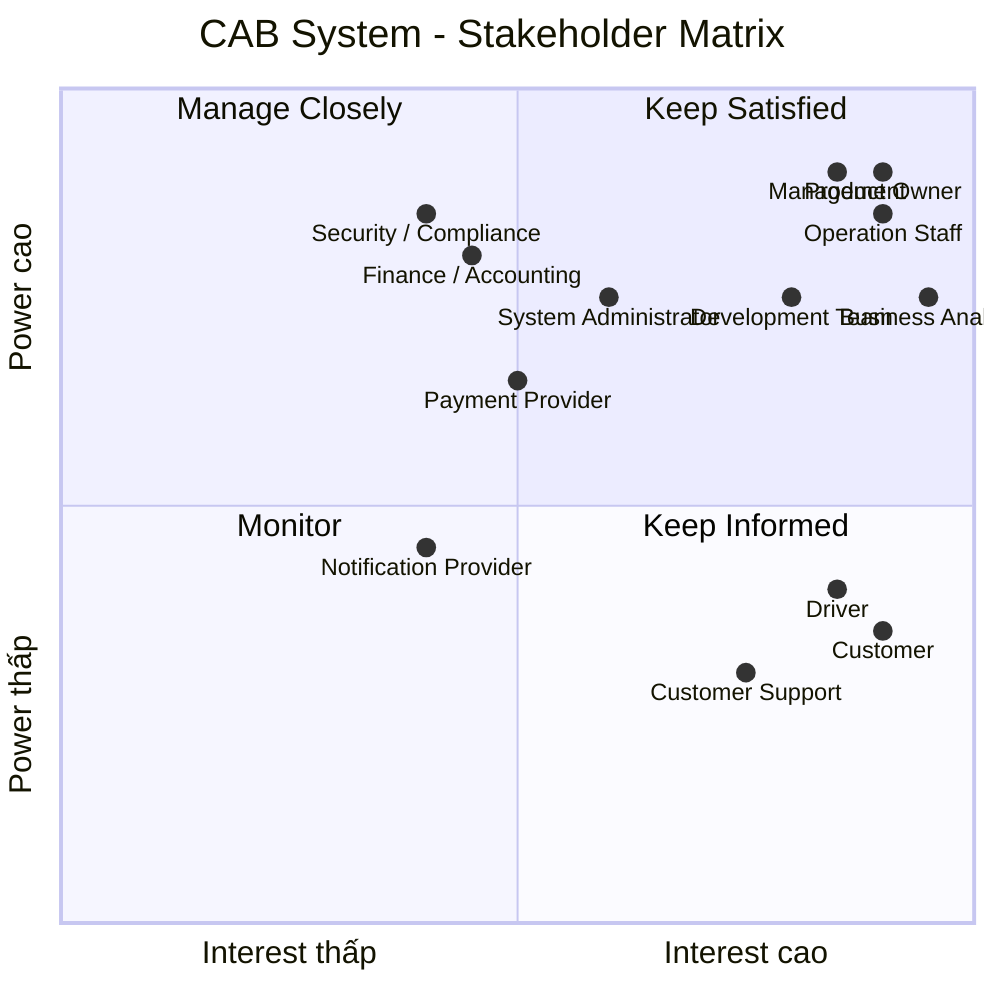

# Bước 1: Tổng quan hệ thống
## 1.1. Vấn đề của hệ thống hiện tại

Hệ thống CAB hiện tại đang tồn tại một số vấn đề:

- Việc phân công tài xế chủ yếu được thực hiện thủ công.
- Khách hàng khó theo dõi trạng thái chuyến đi.
- Thông tin thanh toán chưa được quản lý tập trung.
- Việc tìm kiếm và phân công tài xế chưa được tự động hóa.
- Khi tài xế từ chối hoặc không phản hồi, khách hàng có thể phải chờ lâu.
- Khó xử lý số lượng lớn yêu cầu đặt xe vào thời điểm cao điểm.
- Bộ phận vận hành gặp khó khăn trong việc theo dõi tài xế và các chuyến đang diễn ra.
- Khó tra cứu lịch sử chuyến đi và giao dịch.
- Hệ thống thông báo chưa có kiến trúc linh hoạt để mở rộng thêm nhiều kênh.
- Khó mở rộng hệ thống khi số lượng khách hàng và tài xế tăng.
- Chưa có đầy đủ cơ chế phân quyền và lưu vết các thao tác quan trọng.
- Một số nghiệp vụ chưa được xác định rõ như:
  - Cách tính cước.
  - Tiêu chí ưu tiên tài xế.
  - Thời gian tài xế phản hồi.
  - Chính sách hủy chuyến.
  - Xử lý khi mất kết nối.
  - Thời gian lưu trữ dữ liệu.
## 1.2. Mục tiêu đem lại

Hệ thống CAB mới được xây dựng nhằm:

### Đối với khách hàng

- Đặt xe nhanh chóng và thuận tiện.
- Theo dõi trạng thái chuyến đi.
- Biết thông tin tài xế và thời gian dự kiến đến.
- Xem lịch sử chuyến đi.
- Biết số tiền cần thanh toán.
- Hỗ trợ thanh toán tiền mặt và điện tử.
- Đánh giá tài xế sau khi hoàn thành chuyến.

### Đối với tài xế

- Nhận chuyến tự động dựa trên tiêu chí phù hợp.
- Chủ động chuyển trạng thái sẵn sàng nhận chuyến.
- Nhận thông báo khi có chuyến mới.
- Chấp nhận hoặc từ chối chuyến.
- Cập nhật trạng thái chuyến.
- Cập nhật vị trí để hỗ trợ tìm kiếm tài xế.

### Đối với nhân viên vận hành

- Quản lý khách hàng, tài xế và phương tiện.
- Theo dõi các chuyến đang diễn ra.
- Theo dõi trạng thái tài xế.
- Hỗ trợ xử lý các chuyến bị lỗi.
- Tra cứu lịch sử chuyến đi và giao dịch.
- Theo dõi và quản lý hoạt động của hệ thống.

### Đối với doanh nghiệp

- Tự động hóa quy trình đặt và phân công xe.
- Giảm sự phụ thuộc vào thao tác thủ công.
- Tăng khả năng phục vụ số lượng lớn khách hàng và tài xế.
- Quản lý tập trung dữ liệu chuyến đi và thanh toán.
- Nâng cao khả năng giám sát và báo cáo.
- Đảm bảo bảo mật và phân quyền.
- Có khả năng mở rộng thêm:
  - Loại dịch vụ.
  - Phương thức thanh toán.
  - Nhà cung cấp thanh toán.
  - Kênh thông báo.
  - Các chức năng mới trong tương lai.

---
## 1.3. Ai sử dụng hệ thống?

Hệ thống có 3 nhóm người dùng chính:

| Người dùng | Vai trò | Chức năng chính |
|---|---|---|
| **Customer** | Khách hàng | Đăng ký, đặt xe, theo dõi chuyến, thanh toán, đánh giá |
| **Driver** | Tài xế | Nhận chuyến, cập nhật vị trí, cập nhật trạng thái, hoàn thành chuyến |
| **Operation Staff** | Nhân viên vận hành | Quản lý khách hàng, tài xế, phương tiện, chuyến đi và xử lý sự cố |

### Các bên sử dụng / tương tác khác

| Người dùng / Hệ thống | Vai trò |
|---|---|
| **System Admin** | Quản trị tài khoản, phân quyền và cấu hình hệ thống |
| **Management** | Xem báo cáo, KPI, doanh thu và hiệu quả hoạt động |
| **Finance / Accounting** | Theo dõi giao dịch, thanh toán và doanh thu |
| **Customer Support** | Hỗ trợ khách hàng và tra cứu thông tin chuyến |
| **Payment Gateway** | Xử lý thanh toán điện tử |
| **Notification Provider** | Gửi Push Notification, SMS, Email hoặc các kênh khác |

---
# Bước 2: Stakeholder Analysis

## 2.1. Các bên liên quan – Stakeholder

| Stakeholder | Vai trò |
|---|---|
| **Customer** | Đặt xe, theo dõi chuyến đi, thanh toán và đánh giá tài xế |
| **Driver** | Nhận chuyến, thực hiện chuyến, cập nhật vị trí và trạng thái chuyến |
| **Operation Staff** | Theo dõi chuyến, quản lý tài xế và xử lý các sự cố vận hành |
| **System Administrator** | Quản lý tài khoản, phân quyền và cấu hình hệ thống |
| **Management** | Định hướng kinh doanh, theo dõi KPI, doanh thu và báo cáo |
| **Finance / Accounting** | Quản lý thanh toán, giao dịch và doanh thu |
| **Customer Support** | Hỗ trợ khách hàng và xử lý các yêu cầu liên quan đến chuyến đi |
| **Product Owner** | Xác định mục tiêu sản phẩm, phạm vi và ưu tiên chức năng |
| **Business Analyst (BA)** | Thu thập, phân tích và làm rõ yêu cầu nghiệp vụ |
| **Development Team** | Thiết kế, phát triển, kiểm thử và bảo trì hệ thống |
| **Security / Compliance** | Kiểm soát bảo mật, phân quyền và tuân thủ quy định |
| **Payment Provider** | Xử lý các giao dịch thanh toán điện tử |
| **Notification Provider** | Cung cấp dịch vụ gửi thông báo như Push, SMS, Email |

## 2.2. Stakeholder Matrix

# Business Objectives (BO)

## BO01 – Tự động hóa quy trình đặt xe

Tự động hóa quy trình từ khi khách hàng tạo yêu cầu đặt xe đến khi hoàn thành chuyến, giảm sự phụ thuộc vào tổng đài và thao tác thủ công.

## BO02 – Tối ưu việc phân công tài xế

Tự động tìm và ưu tiên tài xế phù hợp dựa trên vị trí, trạng thái sẵn sàng và các tiêu chí vận hành.

## BO03 – Nâng cao trải nghiệm khách hàng

Cho phép khách hàng đặt xe thuận tiện, theo dõi trạng thái chuyến, thông tin tài xế, thời gian dự kiến đến và lịch sử chuyến đi.

## BO04 – Nâng cao hiệu quả vận hành

Cung cấp công cụ giúp nhân viên vận hành quản lý khách hàng, tài xế, phương tiện, chuyến đi và xử lý các trường hợp bất thường.

## BO05 – Quản lý tập trung thanh toán và doanh thu

Tập trung quản lý thông tin cước phí, giao dịch và kết quả thanh toán, đồng thời hỗ trợ nhiều phương thức thanh toán.

## BO06 – Cải thiện khả năng giám sát và báo cáo

Cung cấp dữ liệu và báo cáo về số lượng chuyến, doanh thu, tỷ lệ hoàn thành, tỷ lệ hủy và hiệu quả hoạt động của tài xế.

## BO07 – Đảm bảo an toàn và bảo mật

Bảo vệ thông tin cá nhân, dữ liệu vị trí và giao dịch; kiểm soát quyền truy cập và lưu vết các thao tác quan trọng.

## BO08 – Đảm bảo khả năng mở rộng

Xây dựng hệ thống có khả năng phục vụ số lượng lớn khách hàng và tài xế, đồng thời cho phép mở rộng từng thành phần khi nhu cầu tăng.

## BO09 – Hỗ trợ mở rộng sản phẩm trong tương lai

Cho phép doanh nghiệp bổ sung loại dịch vụ, phương thức thanh toán, nhà cung cấp thanh toán, kênh thông báo và các chức năng mới mà không phải xây dựng lại toàn bộ hệ thống.
