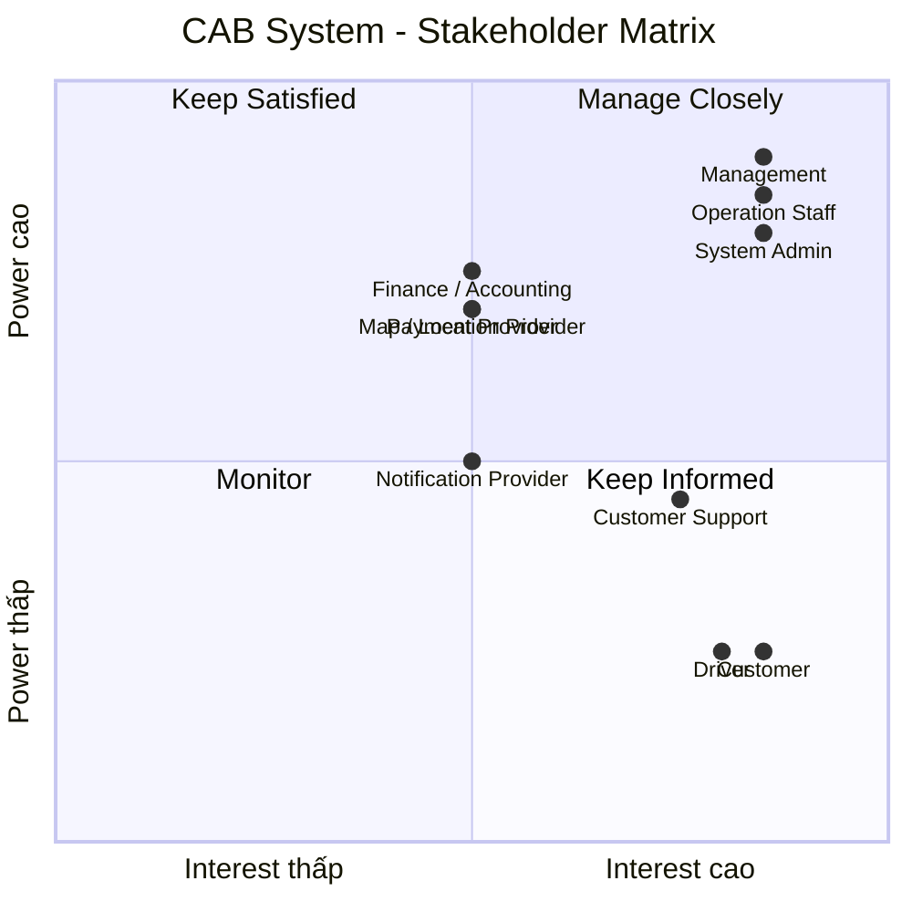

# 23726841_NguyenThanhNghia_cabsystem

# Bước 1: Tổng quan hệ thống

## 1.1. Vấn đề của hệ thống hiện tại

Hệ thống CAB hiện tại đang tồn tại một số vấn đề:

- Việc phân công tài xế chủ yếu được thực hiện thủ công.
- Khách hàng khó theo dõi trạng thái chuyến đi.
- Thông tin thanh toán chưa được quản lý tập trung.
- Việc tìm kiếm và phân công tài xế chưa được tự động hóa.
- Khi tài xế từ chối hoặc không phản hồi, khách hàng có thể phải chờ lâu.
- Khó xử lý số lượng lớn yêu cầu đặt xe vào thời điểm cao điểm.
- Bộ phận vận hành gặp khó khăn trong việc theo dõi tài xế và các chuyến đang diễn ra.
- Khó tra cứu lịch sử chuyến đi và giao dịch.
- Hệ thống thông báo chưa có kiến trúc linh hoạt để mở rộng thêm nhiều kênh.
- Khó mở rộng hệ thống khi số lượng khách hàng và tài xế tăng.
- Chưa có đầy đủ cơ chế phân quyền và lưu vết các thao tác quan trọng.
- Một số nghiệp vụ chưa được xác định rõ như:
  - Cách tính cước.
  - Tiêu chí ưu tiên tài xế.
  - Thời gian tài xế phản hồi.
  - Chính sách hủy chuyến.
  - Xử lý khi mất kết nối.
  - Thời gian lưu trữ dữ liệu.
## 1.2. Mục tiêu đem lại

Hệ thống CAB mới được xây dựng nhằm:

### Đối với khách hàng

- Đặt xe nhanh chóng và thuận tiện.
- Theo dõi trạng thái chuyến đi.
- Biết thông tin tài xế và thời gian dự kiến đến.
- Xem lịch sử chuyến đi.
- Biết số tiền cần thanh toán.
- Hỗ trợ thanh toán tiền mặt và điện tử.
- Đánh giá tài xế sau khi hoàn thành chuyến.

### Đối với tài xế

- Nhận chuyến tự động dựa trên tiêu chí phù hợp.
- Chủ động chuyển trạng thái sẵn sàng nhận chuyến.
- Nhận thông báo khi có chuyến mới.
- Chấp nhận hoặc từ chối chuyến.
- Cập nhật trạng thái chuyến.
- Cập nhật vị trí để hỗ trợ tìm kiếm tài xế.

### Đối với nhân viên vận hành

- Quản lý khách hàng, tài xế và phương tiện.
- Theo dõi các chuyến đang diễn ra.
- Theo dõi trạng thái tài xế.
- Hỗ trợ xử lý các chuyến bị lỗi.
- Tra cứu lịch sử chuyến đi và giao dịch.
- Theo dõi và quản lý hoạt động của hệ thống.

### Đối với doanh nghiệp

- Tự động hóa quy trình đặt và phân công xe.
- Giảm sự phụ thuộc vào thao tác thủ công.
- Tăng khả năng phục vụ số lượng lớn khách hàng và tài xế.
- Quản lý tập trung dữ liệu chuyến đi và thanh toán.
- Nâng cao khả năng giám sát và báo cáo.
- Đảm bảo bảo mật và phân quyền.
- Có khả năng mở rộng thêm:
  - Loại dịch vụ.
  - Phương thức thanh toán.
  - Nhà cung cấp thanh toán.
  - Kênh thông báo.
  - Các chức năng mới trong tương lai.

---
## 1.3. Ai sử dụng hệ thống?

Hệ thống có 3 nhóm người dùng chính:

| Người dùng | Vai trò | Chức năng chính |
|---|---|---|
| **Customer** | Khách hàng | Đăng ký, đặt xe, theo dõi chuyến, thanh toán, đánh giá |
| **Driver** | Tài xế | Nhận chuyến, cập nhật vị trí, cập nhật trạng thái, hoàn thành chuyến |
| **Operation Staff** | Nhân viên vận hành | Quản lý khách hàng, tài xế, phương tiện, chuyến đi và xử lý sự cố |

### Các bên sử dụng / tương tác khác

| Người dùng / Hệ thống | Vai trò |
|---|---|
| **System Admin** | Quản trị tài khoản, phân quyền và cấu hình hệ thống |
| **Management** | Xem báo cáo, KPI, doanh thu và hiệu quả hoạt động |
| **Finance / Accounting** | Theo dõi giao dịch, thanh toán và doanh thu |
| **Customer Support** | Hỗ trợ khách hàng và tra cứu thông tin chuyến |
| **Payment Gateway** | Xử lý thanh toán điện tử |
| **Notification Provider** | Gửi Push Notification, SMS, Email hoặc các kênh khác |

---
## Bước 2: Stakeholder Analysis

## 2.1. Các bên liên quan – Stakeholder

| # | Stakeholder | Vai trò |
|---|---|---|
| 1 | **Management** | Chủ dự án, định hướng kinh doanh, theo dõi KPI, doanh thu và hiệu quả hoạt động |
| 2 | **Customer** | Người sử dụng dịch vụ, đặt xe, theo dõi chuyến, thanh toán và đánh giá tài xế |
| 3 | **Driver** | Người cung cấp dịch vụ vận chuyển, nhận và thực hiện chuyến |
| 4 | **Operation Staff** | Quản lý hoạt động đặt xe, theo dõi chuyến, tài xế và xử lý sự cố vận hành |
| 5 | **System Admin** | Quản trị tài khoản, phân quyền và cấu hình hệ thống |
| 6 | **Finance / Accounting** | Theo dõi giao dịch, thanh toán và doanh thu |
| 7 | **Customer Support** | Hỗ trợ khách hàng và tra cứu thông tin chuyến đi |
| 8 | **Payment Provider** | Cung cấp dịch vụ xử lý thanh toán điện tử |
| 9 | **Notification Provider** | Cung cấp dịch vụ gửi Push Notification, SMS, Email hoặc các kênh khác |
| 10 | **Map / Location Provider** | Cung cấp bản đồ, định vị, khoảng cách và dữ liệu hỗ trợ tính ETA |

---

## 2.2. Stakeholder Matrix

| Stakeholder | Power | Interest | Strategy |
|---|---|---|---|
| **Management** | Cao | Cao | **Manage Closely** – Cập nhật tiến độ, rủi ro, KPI, doanh thu và các quyết định quan trọng |
| **Customer** | Thấp | Cao | **Keep Informed** – Thu thập feedback và cung cấp thông tin về các thay đổi ảnh hưởng đến trải nghiệm |
| **Driver** | Thấp | Cao | **Keep Informed** – Thu thập nhu cầu, feedback và đảm bảo quy trình nhận/thực hiện chuyến phù hợp |
| **Operation Staff** | Cao | Cao | **Manage Closely** – Tham gia phân tích nghiệp vụ, kiểm thử và xác nhận quy trình vận hành |
| **System Admin** | Cao | Cao | **Manage Closely** – Xác định yêu cầu quản trị, phân quyền, cấu hình và bảo mật hệ thống |
| **Finance / Accounting** | Cao | Trung bình | **Keep Satisfied** – Đảm bảo yêu cầu về giao dịch, thanh toán và báo cáo doanh thu |
| **Customer Support** | Trung bình | Cao | **Keep Informed** – Cung cấp công cụ tra cứu và hỗ trợ xử lý các vấn đề của khách hàng |
| **Payment Provider** | Cao | Trung bình | **Keep Satisfied** – Đảm bảo tích hợp, giao dịch và xử lý lỗi thanh toán hoạt động ổn định |
| **Notification Provider** | Trung bình | Trung bình | **Monitor** – Theo dõi khả năng tích hợp và trạng thái dịch vụ |
| **Map / Location Provider** | Cao | Trung bình | **Keep Satisfied** – Đảm bảo dữ liệu vị trí, khoảng cách và ETA hoạt động ổn định |
## 2.2. Stakeholder Matrix 
 

---

# Bước 3: Business Objectives

## 3.1. Mục đích nghiệp vụ

| ID | Mục đích nghiệp vụ | Mô tả |
|---|---|---|
| **BO-01** | **Cải thiện trải nghiệm khách hàng** | Giúp khách hàng đặt xe nhanh chóng, theo dõi trạng thái chuyến, biết thông tin tài xế và thời gian dự kiến đến, xem lịch sử, thanh toán và đánh giá tài xế. |
| **BO-02** | **Tự động hóa quy trình đặt xe** | Giảm sự phụ thuộc vào tổng đài và thao tác thủ công trong việc tiếp nhận yêu cầu, tìm kiếm và phân công tài xế. |
| **BO-03** | **Nâng cao hiệu quả phân công tài xế** | Tự động tìm và ưu tiên tài xế phù hợp dựa trên vị trí, trạng thái sẵn sàng và các tiêu chí vận hành. |
| **BO-04** | **Nâng cao hiệu quả vận hành** | Cung cấp công cụ giúp nhân viên vận hành theo dõi chuyến đi, trạng thái tài xế, quản lý phương tiện và xử lý các trường hợp bất thường. |
| **BO-05** | **Quản lý tập trung dữ liệu** | Tập trung quản lý thông tin khách hàng, tài xế, phương tiện, chuyến đi, giao dịch và lịch sử hoạt động. |
| **BO-06** | **Nâng cao hiệu quả thanh toán** | Chuẩn hóa việc tính cước và hỗ trợ thanh toán tiền mặt hoặc thanh toán điện tử thông qua nhà cung cấp bên ngoài. |
| **BO-07** | **Nâng cao khả năng giám sát và ra quyết định** | Cung cấp dữ liệu và báo cáo về số lượng chuyến, doanh thu, tỷ lệ hoàn thành, tỷ lệ hủy và hiệu quả hoạt động của tài xế. |
| **BO-08** | **Đảm bảo khả năng mở rộng và ổn định** | Xây dựng hệ thống có khả năng phục vụ số lượng lớn khách hàng và tài xế, đồng thời hạn chế ảnh hưởng khi một thành phần gặp sự cố. |
| **BO-09** | **Tăng khả năng mở rộng tính năng** | Cho phép bổ sung loại dịch vụ, phương thức thanh toán, nhà cung cấp thanh toán, kênh thông báo và các chức năng mới trong tương lai. |
| **BO-10** | **Đảm bảo bảo mật và kiểm soát hệ thống** | Bảo vệ dữ liệu cá nhân, dữ liệu vị trí và dữ liệu giao dịch; kiểm soát quyền truy cập và lưu vết các thao tác quan trọng. |

---

## 4. Kế hoạch triển khai 7 tuần

| Tuần | Module | Nội dung chính |
|---|---|---|
| **Tuần 1** | **M01 - Xác thực & Quản lý tài khoản** | Đăng ký, đăng nhập, xác thực, cập nhật thông tin và phân quyền |
| **Tuần 2** | **M02 - Quản lý khách hàng** + **M03 - Quản lý tài xế & phương tiện** | Hồ sơ khách hàng, tài xế, phương tiện và trạng thái hoạt động |
| **Tuần 3** | **M04 - Đặt xe** | Tạo yêu cầu, điểm đón, điểm đến, loại xe và quản lý yêu cầu đặt xe |
| **Tuần 4** | **M05 - Phân công tài xế** + **M06 - Quản lý chuyến đi & định vị** | Tìm tài xế, phân công, xử lý từ chối/timeout, trạng thái chuyến và vị trí |
| **Tuần 5** | **M07 - Tính cước & thanh toán** | Tính cước, tiền mặt, thanh toán điện tử và xử lý giao dịch thất bại |
| **Tuần 6** | **M08 - Thông báo** + **M09 - Vận hành & quản trị** + **M10 - Báo cáo & kiểm toán** | Thông báo, quản lý vận hành, báo cáo, phân quyền và audit log |
| **Tuần 7** | **Tích hợp & hoàn thiện** | Kiểm thử tích hợp, kiểm thử nghiệm thu, sửa lỗi, kiểm thử hiệu năng, triển khai và bàn giao |
## 5. Yêu cầu nghiệp vụ (Business Requirements)

| ID     | Yêu cầu nghiệp vụ | Mô tả |
|--------|---|---|
| BR-01 | **Đặt xe trực tuyến** | Cho phép khách hàng đặt xe trực tuyến, chọn điểm đi, điểm đến một cách nhanh chóng và thuận tiện. |
| BR-02 | **Tự động tìm và phân công tài xế** | Tự động tìm tài xế phù hợp dựa trên vị trí, trạng thái sẵn sàng và các tiêu chí vận hành. |
| BR-03 | **Theo dõi chuyến đi** | Cho phép khách hàng theo dõi trạng thái chuyến đi, thông tin tài xế và thời gian dự kiến tài xế đến. |
| BR-04 | **Đánh giá chuyến đi** | Cho phép khách hàng đánh giá tài xế sau khi chuyến đi hoàn thành và ghi nhận phản hồi để doanh nghiệp theo dõi chất lượng dịch vụ. |
| BR-05 | **Tính cước** | Xác định số tiền khách hàng phải trả dựa trên thông tin chuyến đi và chính sách tính cước của doanh nghiệp. |
| BR-06 | **Quản lý thanh toán** | Hỗ trợ thanh toán tiền mặt và thanh toán điện tử thông qua nhà cung cấp thanh toán bên ngoài. |
| BR-07 | **Quản lý thông báo** | Gửi thông báo cho khách hàng và tài xế về các sự kiện quan trọng trong quá trình đặt và thực hiện chuyến đi. |
| BR-08 | **Quản lý tài xế và phương tiện** | Cho phép quản lý thông tin tài xế, phương tiện, trạng thái hoạt động và vị trí của tài xế. |
| BR-09 | **Quản lý vận hành** | Cung cấp công cụ để nhân viên vận hành quản lý khách hàng, tài xế, phương tiện, chuyến đi và giao dịch. |
| BR-10 | **Báo cáo và thống kê** | Cung cấp báo cáo về số lượng chuyến, doanh thu, tỷ lệ hoàn thành, tỷ lệ hủy và hiệu quả hoạt động của tài xế. |
| BR-11 | **Bảo mật và kiểm soát truy cập** | Bảo vệ thông tin cá nhân, dữ liệu vị trí, dữ liệu giao dịch và kiểm soát quyền truy cập của người dùng. |
| BR-12 | **Khả năng mở rộng và ổn định** | Đảm bảo hệ thống có thể phục vụ số lượng lớn người dùng và hạn chế ảnh hưởng khi một thành phần gặp sự cố. |
| BR-13 | **Khả năng mở rộng tính năng** | Cho phép bổ sung loại dịch vụ, phương thức thanh toán, kênh thông báo và các tính năng mới trong tương lai. |
# Functional Requirements – Driver Matching & Dispatch

## BR-02 – Tự động tìm và phân công tài xế

| ID | Yêu cầu chức năng | Mô tả |
|---|---|---|
| FR-02.01 | Xác định vị trí tài xế | Hệ thống xác định vị trí hiện tại của các tài xế đang hoạt động để phục vụ việc tìm kiếm tài xế phù hợp. |
| FR-02.02 | Kiểm tra trạng thái tài xế | Hệ thống chỉ gửi yêu cầu chuyến đến các tài xế đang ở trạng thái sẵn sàng nhận chuyến (`AVAILABLE`). |
| FR-02.03 | Kiểm tra loại xe | Hệ thống kiểm tra loại xe của tài xế và chỉ đề xuất tài xế có loại xe phù hợp với yêu cầu của khách hàng. |
| FR-02.04 | Xếp hạng tài xế | Hệ thống sắp xếp các tài xế phù hợp dựa trên các tiêu chí nghiệp vụ. Tài xế có đánh giá cao được ưu tiên. |
| FR-02.05 | Ưu tiên tài xế gần khách hàng | Hệ thống ưu tiên các tài xế phù hợp có vị trí gần điểm đón của khách hàng. |
| FR-02.06 | Gửi yêu cầu nhận chuyến | Hệ thống gửi yêu cầu nhận chuyến đến tài xế được ưu tiên. |
| FR-02.07 | Chờ tài xế xác nhận | Hệ thống chờ tài xế phản hồi yêu cầu nhận chuyến trong khoảng thời gian được quy định. |
| FR-02.08 | Xử lý tài xế từ chối | Nếu tài xế từ chối chuyến, hệ thống tiếp tục tìm và gửi yêu cầu đến tài xế phù hợp tiếp theo. |
| FR-02.09 | Xử lý tài xế không phản hồi | Nếu tài xế không phản hồi trong thời gian quy định, hệ thống xem yêu cầu là hết thời gian chờ và tiếp tục tìm tài xế khác. |
| FR-02.10 | Xác nhận tài xế | Khi tài xế chấp nhận chuyến, hệ thống ghi nhận tài xế và cập nhật trạng thái chuyến sang `DRIVER_ASSIGNED`. |
| FR-02.11 | Không tìm được tài xế | Nếu không tìm được tài xế phù hợp, hệ thống thông báo cho khách hàng và cập nhật trạng thái chuyến tương ứng. |

---

