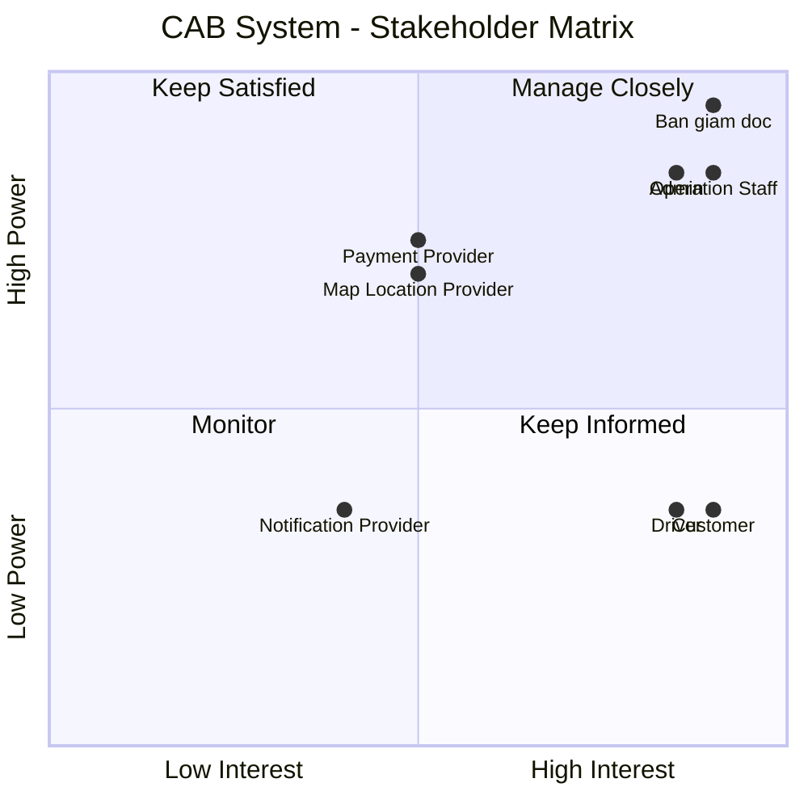

# Bước 1: Tổng quan hệ thống
## 1.1. Vấn đề của hệ thống hiện tại

Hệ thống CAB hiện tại đang tồn tại một số vấn đề:

- Việc phân công tài xế chủ yếu được thực hiện thủ công.
- Khách hàng khó theo dõi trạng thái chuyến đi.
- Thông tin thanh toán chưa được quản lý tập trung.
- Việc tìm kiếm và phân công tài xế chưa được tự động hóa.
- Khi tài xế từ chối hoặc không phản hồi, khách hàng có thể phải chờ lâu.
- Khó xử lý số lượng lớn yêu cầu đặt xe vào thời điểm cao điểm.
- Bộ phận vận hành gặp khó khăn trong việc theo dõi tài xế và các chuyến đang diễn ra.
- Khó tra cứu lịch sử chuyến đi và giao dịch.
- Hệ thống thông báo chưa có kiến trúc linh hoạt để mở rộng thêm nhiều kênh.
- Khó mở rộng hệ thống khi số lượng khách hàng và tài xế tăng.
- Chưa có đầy đủ cơ chế phân quyền và lưu vết các thao tác quan trọng.
- Một số nghiệp vụ chưa được xác định rõ như:
  - Cách tính cước.
  - Tiêu chí ưu tiên tài xế.
  - Thời gian tài xế phản hồi.
  - Chính sách hủy chuyến.
  - Xử lý khi mất kết nối.
  - Thời gian lưu trữ dữ liệu.
## 1.2. Mục tiêu đem lại

Hệ thống CAB mới được xây dựng nhằm:

### Đối với khách hàng

- Đặt xe nhanh chóng và thuận tiện.
- Theo dõi trạng thái chuyến đi.
- Biết thông tin tài xế và thời gian dự kiến đến.
- Xem lịch sử chuyến đi.
- Biết số tiền cần thanh toán.
- Hỗ trợ thanh toán tiền mặt và điện tử.
- Đánh giá tài xế sau khi hoàn thành chuyến.

### Đối với tài xế

- Nhận chuyến tự động dựa trên tiêu chí phù hợp.
- Chủ động chuyển trạng thái sẵn sàng nhận chuyến.
- Nhận thông báo khi có chuyến mới.
- Chấp nhận hoặc từ chối chuyến.
- Cập nhật trạng thái chuyến.
- Cập nhật vị trí để hỗ trợ tìm kiếm tài xế.

### Đối với nhân viên vận hành

- Quản lý khách hàng, tài xế và phương tiện.
- Theo dõi các chuyến đang diễn ra.
- Theo dõi trạng thái tài xế.
- Hỗ trợ xử lý các chuyến bị lỗi.
- Tra cứu lịch sử chuyến đi và giao dịch.
- Theo dõi và quản lý hoạt động của hệ thống.

### Đối với doanh nghiệp

- Tự động hóa quy trình đặt và phân công xe.
- Giảm sự phụ thuộc vào thao tác thủ công.
- Tăng khả năng phục vụ số lượng lớn khách hàng và tài xế.
- Quản lý tập trung dữ liệu chuyến đi và thanh toán.
- Nâng cao khả năng giám sát và báo cáo.
- Đảm bảo bảo mật và phân quyền.
- Có khả năng mở rộng thêm:
  - Loại dịch vụ.
  - Phương thức thanh toán.
  - Nhà cung cấp thanh toán.
  - Kênh thông báo.
  - Các chức năng mới trong tương lai.

---
## 1.3. Ai sử dụng hệ thống?

Hệ thống có 3 nhóm người dùng chính:

| Người dùng | Vai trò | Chức năng chính |
|---|---|---|
| **Customer** | Khách hàng | Đăng ký, đặt xe, theo dõi chuyến, thanh toán, đánh giá |
| **Driver** | Tài xế | Nhận chuyến, cập nhật vị trí, cập nhật trạng thái, hoàn thành chuyến |
| **Operation Staff** | Nhân viên vận hành | Quản lý khách hàng, tài xế, phương tiện, chuyến đi và xử lý sự cố |

### Các bên sử dụng / tương tác khác

| Người dùng / Hệ thống | Vai trò |
|---|---|
| **System Admin** | Quản trị tài khoản, phân quyền và cấu hình hệ thống |
| **Management** | Xem báo cáo, KPI, doanh thu và hiệu quả hoạt động |
| **Finance / Accounting** | Theo dõi giao dịch, thanh toán và doanh thu |
| **Customer Support** | Hỗ trợ khách hàng và tra cứu thông tin chuyến |
| **Payment Gateway** | Xử lý thanh toán điện tử |
| **Notification Provider** | Gửi Push Notification, SMS, Email hoặc các kênh khác |

---
## 2. Stakeholders

| # | Stakeholder | Vai trò |
|---|---|---|
| 1 | **Ban giám đốc** | Chủ dự án, ra quyết định và định hướng kinh doanh |
| 2 | **Khách hàng (Customer)** | Người sử dụng dịch vụ đặt xe |
| 3 | **Tài xế (Driver)** | Người cung cấp dịch vụ vận chuyển |
| 4 | **Nhân viên vận hành (Operation Staff)** | Quản lý và hỗ trợ hoạt động đặt xe |
| 5 | **Admin** | Quản trị hệ thống và phân quyền |
| 6 | **Payment Provider** | Cung cấp dịch vụ thanh toán điện tử |
| 7 | **Notification Provider** | Cung cấp dịch vụ gửi thông báo |
| 8 | **Map / Location Provider** | Cung cấp dịch vụ bản đồ, định vị và ETA |


## 3. Stakeholder Matrix

| Stakeholder | Power | Interest | Strategy |
|---|---|---|---|
| **Ban giám đốc** | Cao | Cao | **Manage Closely** – Thường xuyên cập nhật tiến độ, rủi ro và các quyết định quan trọng |
| **Khách hàng** | Thấp | Cao | **Keep Informed** – Thu thập feedback và cập nhật các thay đổi ảnh hưởng đến trải nghiệm |
| **Tài xế** | Thấp | Cao | **Keep Informed** – Thu thập nhu cầu, feedback và đảm bảo quy trình nhận/thực hiện chuyến phù hợp |
| **Nhân viên vận hành** | Cao | Cao | **Manage Closely** – Tham gia phân tích nghiệp vụ, kiểm thử và xác nhận quy trình |
| **Admin** | Cao | Cao | **Manage Closely** – Tham gia xác định yêu cầu quản trị, bảo mật và phân quyền |
| **Payment Provider** | Cao | Trung bình | **Keep Satisfied** – Đảm bảo tích hợp, giao dịch và xử lý lỗi hoạt động ổn định |
| **Notification Provider** | Trung bình | Trung bình | **Monitor** – Theo dõi khả năng tích hợp và trạng thái dịch vụ |
| **Map/Location Provider** | Cao | Trung bình | **Keep Satisfied** – Đảm bảo dữ liệu vị trí, khoảng cách và ETA hoạt động ổn định |



##  Mục đích nghiệp vụ

| ID | Mục đích nghiệp vụ | Mô tả |
|---|---|---|
| BO-01 | **Cải thiện trải nghiệm khách hàng** | Giúp khách hàng đặt xe nhanh chóng, dễ dàng theo dõi chuyến đi và quản lý thông tin thanh toán. |

```
| BO-02 | **Tự động hóa quy trình đặt xe** | Giảm sự phụ thuộc vào thao tác thủ công trong việc tiếp nhận yêu cầu và phân công tài xế. |
| BO-03 | **Nâng cao hiệu quả phân công tài xế** | Tự động tìm và ưu tiên tài xế phù hợp, gần khách hàng và sẵn sàng nhận chuyến. |
| BO-04 | **Nâng cao hiệu quả vận hành** | Cung cấp công cụ giúp nhân viên vận hành theo dõi, quản lý và xử lý các chuyến đi hiệu quả hơn. |
| BO-05 | **Quản lý tập trung dữ liệu** | Tập trung quản lý thông tin khách hàng, tài xế, phương tiện, chuyến đi và giao dịch. |
| BO-06 | **Tăng tính minh bạch trong thanh toán** | Quản lý tập trung thông tin cước và kết quả thanh toán, đồng thời hỗ trợ nhiều phương thức thanh toán. |
| BO-07 | **Nâng cao khả năng giám sát và ra quyết định** | Cung cấp báo cáo về số lượng chuyến, doanh thu, tỷ lệ hoàn thành, tỷ lệ hủy và hiệu quả tài xế. |
| BO-08 | **Đảm bảo khả năng mở rộng** | Xây dựng nền tảng có thể phục vụ số lượng lớn khách hàng và tài xế khi doanh nghiệp phát triển. |
| BO-09 | **Tăng khả năng mở rộng tính năng** | Cho phép bổ sung dịch vụ, phương thức thanh toán, kênh thông báo và các tính năng mới trong tương lai. |
| BO-10 | **Nâng cao độ ổn định và bảo mật** | Đảm bảo hệ thống hoạt động ổn định, bảo vệ dữ liệu và hạn chế ảnh hưởng khi một thành phần gặp sự cố. |

## 4. System Users

| # | User | Mục đích sử dụng |
|---|---|---|
| 1 | **Customer** | Đặt xe, theo dõi chuyến, thanh toán và đánh giá tài xế |
| 2 | **Driver** | Nhận chuyến, thực hiện chuyến và cập nhật vị trí/trạng thái |
| 3 | **Operation Staff** | Theo dõi và quản lý hoạt động đặt xe, xử lý sự cố |
| 4 | **Admin** | Quản trị hệ thống, phân quyền và theo dõi audit log |


## 5. Yêu cầu nghiệp vụ (Business Requirements)

| ID     | Yêu cầu nghiệp vụ | Mô tả |
|--------|---|---|
| BR-01 | **Đặt xe trực tuyến** | Cho phép khách hàng đặt xe trực tuyến một cách nhanh chóng và thuận tiện. |
| BR-02 | **Tự động tìm và phân công tài xế** | Tự động tìm tài xế phù hợp dựa trên vị trí, trạng thái sẵn sàng và các tiêu chí vận hành. |
| BR-03 | **Theo dõi chuyến đi** | Cho phép khách hàng theo dõi trạng thái chuyến đi, thông tin tài xế và thời gian dự kiến tài xế đến. |
| BR-04 | **Quản lý chuyến đi** | Quản lý toàn bộ vòng đời chuyến đi từ khi tạo yêu cầu đến khi hoàn thành hoặc hủy chuyến. |
| BR-05 | **Tính cước** | Xác định số tiền khách hàng phải trả dựa trên thông tin chuyến đi và chính sách tính cước của doanh nghiệp. |
| BR-06 | **Quản lý thanh toán** | Hỗ trợ thanh toán tiền mặt và thanh toán điện tử thông qua nhà cung cấp thanh toán bên ngoài. |
| BR-07 | **Quản lý thông báo** | Gửi thông báo cho khách hàng và tài xế về các sự kiện quan trọng trong quá trình đặt và thực hiện chuyến đi. |
| BR-08 | **Quản lý tài xế và phương tiện** | Cho phép quản lý thông tin tài xế, phương tiện, trạng thái hoạt động và vị trí của tài xế. |
| BR-09 | **Quản lý vận hành** | Cung cấp công cụ để nhân viên vận hành quản lý khách hàng, tài xế, phương tiện, chuyến đi và giao dịch. |
| BR-10 | **Báo cáo và thống kê** | Cung cấp báo cáo về số lượng chuyến, doanh thu, tỷ lệ hoàn thành, tỷ lệ hủy và hiệu quả hoạt động của tài xế. |
| BR-11 | **Bảo mật và kiểm soát truy cập** | Bảo vệ thông tin cá nhân, dữ liệu vị trí, dữ liệu giao dịch và kiểm soát quyền truy cập của người dùng. |
| BR-12 | **Khả năng mở rộng và ổn định** | Đảm bảo hệ thống có thể phục vụ số lượng lớn người dùng và hạn chế ảnh hưởng khi một thành phần gặp sự cố. |
| BR-13 | **Khả năng mở rộng tính năng** | Cho phép bổ sung loại dịch vụ, phương thức thanh toán, kênh thông báo và các tính năng mới trong tương lai. |
